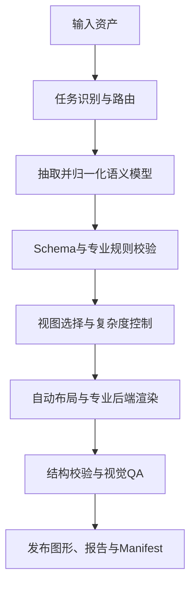

# 芯片研发智能绘图 Skill Suite 详细建设方案

> 文档版本：V1.0  
> 日期：2026-08-11  
> 适用范围：AIXSILICON、IP Development Skill Suite、SoC Integration Skill Suite、RTL Coding Skill Suite、UVM Verification Skill Suite  
> 建设方式：基于 `Agents365-ai/drawio-skill` 派生，保留其通用绘图能力，新增芯片研发专业语义、专用渲染器和工程校验能力

---

## 1. 建设背景与目标

现有 `drawio-skill` 已具备从自然语言生成 `.drawio`、自动布局、形状检索、结构校验、PNG/SVG/PDF 导出、视觉自检、图形 Diff 等通用能力，适合作为可编辑工程图的底层绘图引擎。但芯片研发图形并不只是“方框和连线”，还包含明确的设计层级、接口语义、信号方向、总线协议、位宽、时钟/复位/电源域、状态与时序、电气网络等专业事实。

因此，本项目不直接把原 Skill 改成一个庞大的“电路图提示词”，而是建设一套 **芯片研发智能绘图 Skill Suite**：

```text
自然语言 / Markdown / YAML / RTL / FuseSoC / SystemRDL / IP-XACT / SPICE
                                ↓
                     芯片图形语义模型（SSOT）
                                ↓
                   结构校验 / 规则检查 / 视图裁剪
                                ↓
           Draw.io / Graphviz / WaveDrom / Xschem 等专业后端
                                ↓
          可编辑源文件 + SVG/PNG/PDF + 校验报告 + Manifest
```

### 1.1 总体目标

1. 覆盖 SoC 系统级、IP 微架构级、RTL 行为级和晶体管电路级四类设计对象。
2. 支持框图、互联图、FSM、数字时序图、事务序列图和晶体管原理图等多种视图。
3. 所有图形优先由结构化事实生成，避免大模型直接手写坐标和臆造连接。
4. 输出必须可编辑、可复现、可检查、可追踪，并支持版本差异比较。
5. 与现有 YAML SSOT、FuseSoC、SystemRDL/PeakRDL、RTL、验证和 AIXSILICON 项目座舱形成接口。

### 1.2 非目标

第一阶段不承担以下工作：

- 自动完成模拟 IC 设计或晶体管尺寸优化；
- 替代 Virtuoso 等商业原理图设计平台；
- 从示意图直接生成可 Signoff 的版图或 GDS；
- 仅凭图片恢复百分之百准确的电气网表；
- 用一张超大图承载全部 SoC 细节；
- 把 Draw.io 文件作为芯片设计事实的唯一来源。

---

## 2. 总体架构

### 2.1 “四层设计对象 + 多视图 + 多后端”

| 设计层级 | 核心对象 | 典型视图 | 权威事实来源 | 主渲染后端 |
|---|---|---|---|---|
| L1 SoC 系统级 | SoC、Die、Chiplet、Subsystem、IP 实例 | 顶层框图、总线互联、地址空间、时钟复位、电源域、安全域、中断网络 | SoC Integration YAML、FuseSoC、IP-XACT | Draw.io + Graphviz |
| L2 IP 微架构级 | Module、Datapath、Control、Pipeline、Buffer、Arbiter | IP 功能框图、数据通路、流水线、CDC/RDC、安全机制 | LRS/HLD/LLD、RTL、SystemRDL | Draw.io + Graphviz |
| L3 RTL 行为级 | Signal、State、Transition、Transaction、Cycle | FSM、WaveDrom、协议序列图、流水线周期图 | RTL、SVA、Testplan、协议规格 | Graphviz + WaveDrom + Draw.io |
| L4 Circuit/Transistor 级 | Device、Net、Pin、Subcircuit、Model | CMOS 门、标准单元、模拟子电路、晶体管原理图 | SPICE/CDL、PDK 符号与模型 | Xschem + SPICE；Draw.io 仅作示意 |

WaveDrom 和 FSM 是横向的行为视图，不是独立的物理抽象层级。它们主要服务于 L2/L3，也可以用于描述 SoC 级复位、上电和中断响应流程。

### 2.2 Skill Suite 组成

```text
chip-design-diagram-suite
├── chip-diagram-router              # 统一入口、任务分类和编排
├── draw-soc-architecture            # SoC/Subsystem/互联/域视图
├── draw-ip-architecture             # IP微架构/数据通路/流水线
├── draw-rtl-behavior                # FSM/WaveDrom/事务序列
├── draw-transistor-schematic        # 晶体管示意图与工程原理图
└── diagram-common                   # 公共Schema、主题、布局、校验、导出
```

其中前五项为可独立触发的 Skill；`diagram-common` 是公共代码与资源包，不作为用户直接触发入口。

### 2.3 统一执行流水线



失败处理原则：

- 事实不完整时，显式输出 `TBD` 和待确认项，不得静默补全关键连接；
- Schema 错误、端点不存在、电气短路等严重问题必须阻断生成；
- 轻微布局或非关键悬空问题允许带告警输出草稿；
- 所有自动推断必须在 Manifest 中记录来源和置信度；
- 原始输入、归一化模型、最终输出之间必须能追踪。

---

## 3. Skill 设计

### 3.1 `chip-diagram-router`：统一入口与路由

### 职责

- 理解用户请求，识别设计层级和视图类型；
- 判断输入是自然语言、YAML、RTL、FuseSoC、IP-XACT、SystemRDL 还是 SPICE；
- 选择一个或多个专业子 Skill；
- 建立输出目录、任务 Manifest 和跨图关联；
- 对复杂系统自动拆分顶层图和下钻图；
- 汇总所有子图及校验结果。

### 路由规则

| 用户意图或输入 | 路由目标 |
|---|---|
| “画 SoC 顶层、总线、地址、中断、安全岛” | `draw-soc-architecture` |
| “画某 IP 内部模块、流水线、FIFO、CDC” | `draw-ip-architecture` |
| “画状态机、时序、握手、读写事务” | `draw-rtl-behavior` |
| “画 CMOS 门、MOS 网络、SPICE 子电路” | `draw-transistor-schematic` |
| 同时要求 SoC 框图和中断时序 | 先 SoC，再调用 RTL behavior 生成关联子图 |
| 无法判断工程原理图还是文档示意图 | 要求用户在 `illustration` 与 `engineering` 中选择 |

### 输入

- 用户自然语言请求；
- 本地或仓库中的规格、RTL、YAML、FuseSoC `.core`、IP-XACT XML、SystemRDL、SPICE/CDL；
- 可选的主题、页面大小、语言、输出格式和详细度。

### 输出

```text
docs/diagrams/<design-name>/
├── index.md
├── diagram-set.yaml
├── manifest.yaml
├── validation-summary.md
└── <view-name>/...
```

### 路由器禁止事项

- 不直接手写大规模 Draw.io XML；
- 不把未知端口或网络当成已确认事实；
- 不用 WaveDrom 代替事务序列图；
- 不用 Draw.io 作为 Engineering Mode 晶体管网表的权威源；
- 不在一个 Skill 上下文中加载所有层级的详细参考资料。

---

### 3.2 `draw-soc-architecture`：SoC 系统级绘图

### 支持视图

| 视图 ID | 内容 | 默认详细度 |
|---|---|---|
| `soc_overview` | CPU/DSP/NPU/Memory/Peripheral/Subsystem 总览 | IP 实例级 |
| `bus_interconnect` | AXI/AHB/APB/CHI/NoC/TileLink 连接 | 逻辑接口级 |
| `address_map` | Initiator、Target、Address Window | 地址窗口级 |
| `clock_reset` | Clock Source、Divider、Gate、Reset Controller、域关系 | Clock/Reset Domain 级 |
| `power_domain` | Power Domain、Switch、Isolation、Retention、Level Shifter | 电源域级 |
| `interrupt_network` | IRQ Source、Aggregator、PIC/PLIC/CLIC/GIC、CPU/Safety Island | 中断源与汇聚级 |
| `safety_security` | Safety/Security Domain、Firewall、Monitor、Lockstep | 机制级 |
| `fusesoc_dependency` | Core、Dependency、Target、Generator | Core 依赖级 |
| `chiplet_topology` | Die、D2D、NoC、Memory Die、PHY | Die 级 |

### 专业对象

```yaml
soc:
  instances: []
  interfaces: []
  connections: []
  address_spaces: []
  clock_domains: []
  reset_domains: []
  power_domains: []
  safety_domains: []
  security_domains: []
  interrupts: []
  hierarchies: []
```

### 关键校验

- 接口端点是否存在；
- Initiator/Target、Master/Slave 或 Source/Sink 方向是否合法；
- 协议类型、版本、数据位宽、地址位宽、ID 位宽是否兼容；
- 地址窗口是否重叠、越界或无上游可达路径；
- 跨时钟域是否存在 CDC 处理或 waiver；
- 跨复位域是否存在 Reset Sync/RDC 处理；
- 跨电源域是否需要 Isolation、Retention、Level Shifter；
- 跨安全/安全保密域连接是否经过允许的 Bridge/Firewall；
- 中断是否重复编号、悬空或存在多驱动；
- Mandatory Port 是否悬空；
- FuseSoC 依赖是否缺失或形成循环；
- 图中连接是否能回溯到 SSOT 或源文件。

### 布局规则

- 主数据流默认从左到右；
- CPU/Initiator 放左侧，Memory/Target/外设放右侧；
- Interconnect/NoC 位于中间主干；
- CRG、Power Manager、Safety Manager 优先放顶部；
- 外部接口和 PHY 靠页面边缘；
- Subsystem 使用容器表达层级；
- 不同 Power/Safety/Security Domain 使用淡色容器和清晰图例；
- 总线默认收敛为一条逻辑接口，不自动展开 AXI 五通道；
- 超过 20 个可见 Block 或 35 条连接时，触发自动拆图建议；
- 所有连接采用正交路由，不穿越 Block。

---

### 3.3 `draw-ip-architecture`：IP 微架构绘图

### 支持视图

- IP 功能组成图；
- 数据通路与控制通路图；
- Pipeline Stage 图；
- Buffer/FIFO/Queue 结构图；
- Arbiter、MUX、Decoder、Scheduler 图；
- AXI/AHB/APB 等接口展开图；
- 寄存器接口与控制路径图；
- CDC/RDC 结构图；
- ECC、Parity、Lockstep、Watchdog 等安全机制图；
- RTL Module/Instance 层级图；
- 数据格式、位宽转换和 Pack/Unpack 图。

### 专业对象

```yaml
ip:
  modules: []
  ports: []
  interfaces: []
  datapaths: []
  control_paths: []
  pipelines: []
  buffers: []
  arbiters: []
  register_interfaces: []
  cdc_paths: []
  rdc_paths: []
  safety_mechanisms: []
  rtl_bindings: []
```

### 关键校验

- Module 与 RTL 实例绑定是否存在；
- Port 名称、方向和位宽是否与 RTL 一致；
- 数据通路位宽是否匹配；
- 位宽转换是否经过明确的 Converter；
- 流水级编号、Latency 和 Valid/Ready 关系是否完整；
- FIFO 深度、数据宽度与接口是否一致；
- 多源驱动是否经过 MUX/Arbiter；
- CDC 是否经过 Synchronizer、Handshake 或 Async FIFO；
- 脉冲跨域是否有 Pulse Synchronizer 或协议保证；
- Reset Deassert 是否同步；
- 寄存器字段引用是否能绑定 SystemRDL；
- 安全机制的检测对象、故障响应和上报路径是否完整。

### IP 图形约定

- 数据通路使用蓝色粗实线；
- 控制通路使用紫色细实线；
- Clock 使用绿色虚线；Reset 使用灰色虚线；
- Interrupt/Error 使用橙色实线；
- CDC/RDC Block 使用黄色底色；
- Safety Mechanism 使用红色边框；
- 输入端口在左侧，输出端口在右侧；
- Clock/Reset/Power 端口优先置于上侧或下侧；
- Pipeline Stage 使用等宽泳道或顶部 Stage 标记；
- 位宽、协议、Latency 作为边标签，不用颜色单独表达。

---

### 3.4 `draw-rtl-behavior`：FSM、WaveDrom 与事务序列

该 Skill 内部包含三个后端，但共享行为级元数据、输入追踪和质量出口。

### A. FSM 视图

#### 输入模型

```yaml
schema_version: 1.0
diagram:
  id: dma-control-fsm
  type: fsm
  title: DMA Control FSM
  abstraction: rtl_behavior

behavior:
  initial_state: idle
  states:
    - id: idle
      category: normal
    - id: transfer
      category: normal
    - id: error
      category: fault
  transitions:
    - from: idle
      to: transfer
      condition: start && cfg_valid
      action: clear_count
    - from: transfer
      to: idle
      condition: last_beat
      action: set_done_irq
    - from: transfer
      to: error
      condition: bus_error
      action: set_error_irq
```

#### FSM 校验

- 初始状态必须存在且唯一；
- 所有 Transition 端点必须存在；
- 检查不可达状态、无出口状态和孤立状态；
- 检查同一状态下明显冲突或重复条件；
- 检查 Default/Error/Recovery 路径；
- 可选检查状态编码是否重复或不完整；
- 从 RTL 提取时，比较 `case` 分支、状态寄存器和跳转条件；
- 不确定条件必须标为 `inferred`，不能伪装成 RTL 事实。

#### 输出

```text
dma-control-fsm/
├── model.normalized.yaml
├── dma-control-fsm.dot
├── dma-control-fsm.svg
├── dma-control-fsm.drawio
└── validation.md
```

### B. WaveDrom 数字时序视图

#### 适用场景

- AXI/APB/AHB 读写示例；
- Ready/Valid、Request/Acknowledge 握手；
- Reset Assertion/Deassertion；
- Clock Gating 与切频；
- Interrupt 产生、锁存、清除；
- CDC 握手；
- Pipeline 周期关系；
- Fault Injection、Detection、Response 时序。

#### 输入模型

```yaml
schema_version: 1.0
diagram:
  id: apb-write-timing
  type: timing
  title: APB Write Transaction
  abstraction: rtl_behavior

behavior:
  clock:
    name: pclk
    period: 10ns
  signals:
    - name: psel
      wave: "0.1...0"
    - name: penable
      wave: "0..1..0"
    - name: pwrite
      wave: "0.1...0"
    - name: paddr
      wave: "x.3...x"
      data: ["ADDR"]
    - name: pwdata
      wave: "x.4...x"
      data: ["DATA"]
    - name: pready
      wave: "1.....1"
  markers:
    - cycle: 2
      text: setup
    - cycle: 3
      text: access
```

#### 时序校验

- Wave 字符串长度和 Signal 数据数量是否一致；
- Clock 与时间标尺是否存在；
- 必选信号是否缺失；
- 协议规则是否满足，例如 APB 的 Setup/Access 相位；
- Ready/Valid 场景是否存在数据稳定性冲突；
- Reset 释放与 Clock 的关系是否合理；
- 图示例是“规范要求”“RTL 仿真采样”还是“AI 推断”必须明确标注。

### C. 事务序列视图

事务序列图用于表达 Actor/Module 之间的消息次序，不承担逐周期电平表达。

典型场景：

- CPU → DMA → Interconnect → Memory；
- Interrupt Source → PIC → Safety Island/CLIC；
- Power Manager → CRG → Subsystem Reset；
- Bus Error → Monitor → Fault Manager → System Response；
- UVM Sequence → Driver → DUT → Monitor → Scoreboard。

输出优先为可编辑 Draw.io 序列图，并可附 Mermaid/Markdown 版本用于文档内嵌。

---

### 3.5 `draw-transistor-schematic`：晶体管级绘图

该 Skill 必须区分两种模式。

### Illustration Mode

用途：规格、培训、评审和 PPT 中的 CMOS 反相器、NAND/NOR、Latch、Level Shifter、SRAM Bitcell 等原理示意。

特点：

- 使用 Draw.io/SVG 输出；
- 强调可读性和结构说明；
- 允许简化 Bulk、模型和参数；
- 输出必须标注 `NON-SIMULATABLE ILLUSTRATION`；
- 不生成权威 SPICE 网表。

### Engineering Mode

用途：基于 SPICE/CDL/PDK 符号生成或检查具有网络语义的原理图。

特点：

- 以 SPICE/CDL 或结构化 Circuit YAML 为事实源；
- 使用 Xschem 作为原理图后端；
- Device 必须具有类型、模型、参数和端子；
- 输出 Xschem 源文件、SPICE 网表、SVG/PDF 和 ERC 报告；
- 需要 PDK 时由环境提供 PDK 路径和符号库，Skill 不携带商业 PDK。

### 输入模型

```yaml
schema_version: 1.0
diagram:
  id: cmos-inverter
  type: transistor_schematic
  title: CMOS Inverter
  abstraction: transistor
  mode: engineering

circuit:
  ports:
    - {name: a, direction: input}
    - {name: y, direction: output}
    - {name: vdd, kind: power}
    - {name: vss, kind: ground}
  devices:
    - id: mp0
      type: pmos
      model: pmos_1v8
      parameters: {w: 2.0um, l: 0.18um}
      terminals: {g: a, d: y, s: vdd, b: vdd}
    - id: mn0
      type: nmos
      model: nmos_1v8
      parameters: {w: 1.0um, l: 0.18um}
      terminals: {g: a, d: y, s: vss, b: vss}
```

### 工程校验

- Device、Net、Port 名称唯一；
- MOS 四端连接完整；
- Bulk 连接满足项目规则；
- 电源和地不存在直接短路；
- 无悬空 Gate 或未声明网络；
- Model 和 Symbol 可解析；
- 参数单位和数值格式合法；
- Subcircuit 实例端口数与定义一致；
- Schematic Netlist 与输入 SPICE/CDL 结构一致；
- ERC 错误阻断正式输出，告警进入 waiver 流程。

---

## 4. 统一语义模型设计

### 4.1 公共 Envelope

所有图类型共享以下外层字段，但内部专业模型分开定义，禁止形成单个超级 Schema。

```yaml
schema_version: 1.0

diagram:
  id: pic-subsystem-overview
  type: soc_architecture
  subtype: interrupt_network
  title: Platform Interrupt Controller Subsystem
  abstraction: soc
  language: zh-CN
  status: draft

provenance:
  sources:
    - path: specs/pic_hld.md
      role: specification
    - path: integration/pic.yaml
      role: ssot
  generated_at: 2026-08-11T17:00:00+08:00
  generator: chip-design-diagram-suite

style:
  theme: aixsilicon-light
  page: 16:9
  colorblind_safe: true

layout:
  direction: left_to_right
  detail_level: architecture
  max_visible_blocks: 20

outputs:
  editable: [drawio]
  rendered: [svg, png, pdf]
  reports: [validation, manifest]

traceability:
  requirement_ids: [PIC-LRS-001, PIC-HLD-012]
  design_version: 1.0.0
```

然后按 `diagram.type` 仅允许一个专用节点：

```yaml
soc: {}
ip: {}
behavior: {}
circuit: {}
```

### 4.2 对象级追踪字段

Block、Port、Connection、State、Signal、Device 都应支持：

```yaml
trace:
  source_refs:
    - file: specs/pic_hld.md
      anchor: PIC-HLD-012
    - file: rtl/pic_top.sv
      symbol: u_irq_capture
  confidence: confirmed       # confirmed / extracted / inferred / tbd
  owner: digital-design
  review_status: reviewed
```

渲染规则：

- `confirmed`：正常样式；
- `extracted`：正常样式，在属性中保留来源；
- `inferred`：虚线边框或推断标记；
- `tbd`：灰色虚线并显示 `TBD`；
- 低置信度信息不得隐藏来源状态。

### 4.3 View Filter

一份 SSOT 应能生成多张图。视图文件只定义选择和显示策略，不复制事实：

```yaml
view:
  id: pic-interrupt-view
  source_model: ../../model/pic-subsystem.yaml
  include:
    connection_kinds: [interrupt]
    blocks: [irq_sources, pic, clic, safety_island]
  show:
    ports: true
    widths: true
    clock_domains: true
    power_domains: false
  collapse:
    axi_channels: true
```

---

## 5. 输入适配器

| 输入类型 | V1 能力 | 归一化结果 | 备注 |
|---|---|---|---|
| 自然语言/Markdown | 提取候选 Block、关系、状态、时序 | 标注为 `inferred` 的 YAML | 关键连接需用户或事实源确认 |
| SoC Integration YAML | 直接映射实例、接口、域和连接 | SoC YAML | 推荐权威来源 |
| FuseSoC `.core` | 提取 VLNV、依赖、fileset、target、parameter | 依赖/工程视图 | 不默认推断 RTL 端口互联 |
| SystemVerilog | 提取 module、port、instance、parameter、enum FSM | IP/行为模型 | 复杂 generate/interface 需分阶段支持 |
| SystemRDL | 提取寄存器层级和接口信息 | IP 寄存器视图 | 复用 PeakRDL 能力 |
| IP-XACT | 提取 component、busInterface、memoryMap、design | SoC/IP 模型 | 作为交换格式，不建议人工直接维护 XML |
| WaveJSON | 直接导入时序模型 | Behavior Timing | 保留原始周期表达 |
| SPICE/CDL | 提取 subckt、device、net、parameter | Circuit 模型 | Engineering Mode 权威输入 |
| 现有 `.drawio` | 提取 Cell、Edge、Label 和页面 | Graph 模型 | 用于重构、Diff、风格复用，不自动视为设计 SSOT |
| 图片/白板照片 | 识别候选对象与连接 | `inferred` Graph | 必须人工复核 |

### 输入优先级

同一事实出现冲突时，默认优先级为：

```text
项目指定 SSOT
  > 已评审的结构化设计文件
  > RTL / SPICE 等实现事实
  > 已评审规格
  > 未评审文档
  > 现有图形
  > 自然语言和图片推断
```

项目可在 `diagram-policy.yaml` 中覆盖该顺序。

---

## 6. 渲染与工具链

| 引擎 | 主要用途 | 必须输出 | 在本项目中的定位 |
|---|---|---|---|
| Draw.io | SoC/IP 框图、序列图、可编辑交付 | `.drawio`、SVG/PNG/PDF | 主交互和评审格式 |
| Graphviz | 大型有向图、FSM、依赖图自动布局 | DOT、SVG、布局坐标 | 确定性布局引擎 |
| WaveDrom | 数字信号时序 | WaveJSON、SVG/PNG | 逐周期数字时序权威渲染器 |
| Xschem | 晶体管/电路工程原理图 | `.sch`、SPICE、SVG/PDF | Circuit Engineering Mode 后端 |
| Mermaid | Markdown 内嵌的简化图 | Markdown/Mermaid | 便携展示，不作为复杂框图主源 |

### 对原 `drawio-skill` 的复用策略

优先复用或封装：

- Draw.io XML 生成与导出；
- `autolayout.py` 自动布局；
- `validate.py` 结构检查；
- `shapesearch.py` 形状检索；
- `drawiodiff.py` 图形差异；
- `relabel.py` 中英文版本；
- `restyle.py` 主题转换；
- `explain.py` 图形反向说明；
- `drawiohtml.py` 交互式浏览；
- PNG 导出后的视觉自检流程。

应新增而不是硬改通用逻辑：

- 芯片专用 Schema 与解析器；
- SoC/IP/Behavior/Circuit 规则检查器；
- 端口锚点和总线正交路由；
- Domain 容器与跨域对象；
- WaveDrom/Xschem 后端适配；
- RTL/FuseSoC/SystemRDL/IP-XACT/SPICE 抽取器；
- Traceability 和 Manifest 生成；
- 大图拆分和多页面下钻。

---

## 7. 仓库与 Skill 目录设计

建议单一代码仓维护，共享引擎和测试；安装时暴露多个独立 Skill。

```text
chip-design-diagram-suite/
├── pyproject.toml
├── package.json
├── schemas/
│   ├── common.schema.json
│   ├── soc.schema.json
│   ├── ip.schema.json
│   ├── fsm.schema.json
│   ├── timing.schema.json
│   ├── sequence.schema.json
│   └── circuit.schema.json
├── engines/
│   ├── drawio/
│   ├── graphviz/
│   ├── wavedrom/
│   └── xschem/
├── adapters/
│   ├── markdown_adapter.py
│   ├── fusesoc_adapter.py
│   ├── systemverilog_adapter.py
│   ├── systemrdl_adapter.py
│   ├── ipxact_adapter.py
│   ├── spice_adapter.py
│   └── drawio_adapter.py
├── validators/
│   ├── common_validator.py
│   ├── soc_validator.py
│   ├── ip_validator.py
│   ├── behavior_validator.py
│   └── circuit_validator.py
├── libraries/
│   ├── themes/
│   │   ├── aixsilicon-light.yaml
│   │   └── aixsilicon-dark.yaml
│   ├── soc-blocks/
│   ├── ip-blocks/
│   ├── protocol-symbols/
│   └── transistor-symbols/
├── skills/
│   ├── chip-diagram-router/
│   │   ├── SKILL.md
│   │   ├── agents/openai.yaml
│   │   └── references/diagram-routing.md
│   ├── draw-soc-architecture/
│   │   ├── SKILL.md
│   │   ├── agents/openai.yaml
│   │   └── references/
│   │       ├── soc-conventions.md
│   │       ├── protocols.md
│   │       └── domain-rules.md
│   ├── draw-ip-architecture/
│   │   ├── SKILL.md
│   │   ├── agents/openai.yaml
│   │   └── references/
│   │       ├── ip-conventions.md
│   │       ├── pipeline-and-datapath.md
│   │       └── cdc-rdc.md
│   ├── draw-rtl-behavior/
│   │   ├── SKILL.md
│   │   ├── agents/openai.yaml
│   │   └── references/
│   │       ├── fsm.md
│   │       ├── timing.md
│   │       └── sequence.md
│   └── draw-transistor-schematic/
│       ├── SKILL.md
│       ├── agents/openai.yaml
│       └── references/
│           ├── illustration-mode.md
│           ├── engineering-mode.md
│           └── erc-rules.md
├── examples/
│   ├── pic-subsystem/
│   ├── axi-width-converter/
│   ├── dma-fsm/
│   ├── apb-timing/
│   └── cmos-inverter/
└── tests/
    ├── unit/
    ├── golden/
    ├── integration/
    └── visual/
```

### Skill 文件控制原则

- 每个 `SKILL.md` 控制在 500 行以内，只描述核心工作流和资源路由；
- 协议、Schema、符号、示例等细节放到一级 `references/`；
- 确定性生成、抽取和校验必须由 `scripts/` 或共享 Python 包完成；
- 图片、主题、模板和符号放 `assets/` 或公共 `libraries/`；
- 不在 Skill 内增加重复的 README、Quick Start、Changelog 等辅助文档；
- 子 Skill 只加载与本次绘图类型相关的参考资料。

---

## 8. 命令行与 API 设计

统一 CLI 建议命名为 `chipdiagram`。

```bash
# 从结构化模型生成
chipdiagram build integration/pic.yaml \
  --view interrupt_network \
  --format drawio,svg,png \
  --out docs/diagrams/pic

# 从 RTL 抽取 IP 结构
chipdiagram extract rtl/pic_top.sv \
  --type ip \
  --top pic_top \
  --out build/diagram-model/pic.yaml

# 生成 FSM
chipdiagram build specs/dma_fsm.yaml \
  --view fsm \
  --out docs/diagrams/dma-fsm

# 校验但不生成
chipdiagram validate integration/soc.yaml \
  --profile soc-signoff

# 比较两个版本
chipdiagram diff old/manifest.yaml new/manifest.yaml \
  --out reports/diagram-diff
```

### 稳定的内部 API

```python
model = load_and_normalize(inputs, policy)
issues = validate(model, profile)
views = select_views(model, request)
layout = compute_layout(view, theme)
artifacts = render(view, layout, formats)
qa = inspect_artifacts(artifacts)
manifest = publish(model, issues, artifacts, qa)
```

渲染器不得重新解释设计语义；它只接收已校验的标准模型和布局策略。

---

## 9. 标准输出件

每个视图至少产生：

```text
<view-name>/
├── source.yaml                 # 用户输入或View定义
├── model.normalized.yaml       # 归一化后的事实模型
├── diagram.drawio              # SoC/IP/Sequence适用
├── diagram.svg
├── diagram.png
├── diagram.pdf                 # 用户要求或正式评审时
├── validation.json             # 机器可读
├── validation.md               # 人可读
└── manifest.yaml
```

不同后端补充：

- FSM：`.dot`；
- WaveDrom：`.wave.json`；
- Xschem：`.sch` 和生成的 `.spice`；
- 多页面系统图：`index.drawio`、`index.md` 和下钻链接。

### Manifest 示例

```yaml
manifest_version: 1.0
diagram_id: pic-subsystem-overview
design_version: 1.0.0
model_hash: sha256:...
source_files:
  - path: integration/pic.yaml
    hash: sha256:...
artifacts:
  - path: diagram.drawio
    format: drawio
  - path: diagram.svg
    format: svg
statistics:
  blocks: 8
  ports: 23
  connections: 17
quality:
  schema_errors: 0
  rule_errors: 0
  warnings: 2
  visual_issues: 0
assumptions:
  - id: ASM-001
    text: CLIC interrupt width inferred as 64
    status: pending_confirmation
```

---

## 10. 质量门禁

### Gate 1：输入完整性

- 输入文件可读取；
- Diagram ID、Type、Title、Source 存在；
- 指定 Top/Module/Subcircuit 可解析；
- Schema 校验通过。

### Gate 2：语义一致性

- 所有端点存在；
- 对象 ID 唯一；
- 方向、协议、位宽、域或电气连接规则通过；
- 严重错误数量为 0；
- 所有推断和 TBD 已记录。

### Gate 3：布局质量

- Block 不重叠；
- 标签不裁切；
- 连接线不穿过 Block；
- 页面边界不溢出；
- 图例完整；
- 字体和最小字号满足主题要求。

### Gate 4：渲染与可编辑性

- `.drawio` 能正常打开；
- SVG/PNG/PDF 导出成功；
- 关键对象数量与模型一致；
- Draw.io 中节点和连接保留稳定 ID；
- 下钻链接可用。

### Gate 5：追踪与发布

- Manifest 完整；
- 输入 Hash、模型 Hash、生成器版本已记录；
- Requirement/RTL/对象追踪可查询；
- Validation Report 已生成；
- CI 结果允许发布。

### 严重度定义

| 等级 | 含义 | 行为 |
|---|---|---|
| ERROR | 会导致错误事实、非法连接或不可用输出 | 阻断正式生成 |
| WARNING | 信息不完整或存在设计风险 | 允许草稿，正式发布需处理/waiver |
| INFO | 建议优化布局或表达 | 不阻断 |

---

## 11. 测试与验收方案

### 11.1 测试分层

| 测试层 | 内容 | 方法 |
|---|---|---|
| Unit | Schema、解析、规则、布局辅助函数 | Pytest/Node Test |
| Golden | 固定输入与归一化模型、DOT/WaveJSON/Draw.io 结构比较 | Golden File Diff |
| Integration | 输入适配器 → 校验 → 渲染 → Manifest | 端到端流水线 |
| Visual | 重叠、裁切、线穿块、字号、色彩 | 结构算法 + PNG 视觉检查 |
| Round-trip | YAML → Draw.io → Extract，SPICE → Xschem → Netlist | 结构等价比较 |
| Regression | 原有 Draw.io 能力与芯片新增能力 | CI 回归集 |

### 11.2 首批五个 Golden Case

### Case 1：PIC Subsystem

覆盖：2~3 个 Subsystem、多组 IRQ、同步、汇聚、锁存、PIC、CLIC、安全岛、APB 配置、Clock/Power Domain。

验收：

- 输出 SoC Overview、Interrupt Network、Clock/Reset、Safety View；
- 所有 IRQ 位宽和方向可见；
- 跨域路径显式经过 Synchronizer；
- 一份 SSOT 生成四张一致图；
- 图中对象能追踪到 PIC HLD/LRS。

### Case 2：AXI Width/Clock Converter IP

覆盖：32~1024 bit 参数化位宽、异步时钟、FIFO、Channel、Burst、Outstanding、Backpressure。

验收：

- 输出 IP Overview、五通道展开、CDC 和 Pipeline 图；
- 位宽不匹配时能识别 Converter；
- 缺少 Async FIFO/Handshake 时产生 ERROR；
- 图与 RTL Port 抽取结果可比较。

### Case 3：DMA FSM

覆盖：Idle、Config、Transfer、Complete、Error、Recovery。

验收：

- 生成 DOT、SVG 和 Draw.io；
- 检出不可达状态和缺少 Recovery；
- 可与 RTL enum/case 做基本一致性检查。

### Case 4：APB/AXI 时序

覆盖：正常事务、Wait State、Error Response、Backpressure。

验收：

- YAML 编译为 WaveJSON；
- 协议必选信号完整；
- 数据/控制信号周期对齐；
- 输出 SVG/PNG，并标识规范示例或仿真采样来源。

### Case 5：CMOS Inverter + Level Shifter

覆盖：Illustration 与 Engineering 两模式。

验收：

- 示意图明确标识不可仿真；
- 工程模式生成 Xschem 与 SPICE；
- 检出 Bulk 错接、悬空 Gate 和电源短路；
- Round-trip 网表结构一致。

### 11.3 V1.0 量化验收指标

| 指标 | 目标 |
|---|---|
| 结构化输入生成成功率 | Golden Case 100% |
| Schema/端点/方向类已注入错误检出率 | 100% |
| 位宽、跨域、地址冲突类已注入错误检出率 | ≥95% |
| 图中 Block/Connection 与模型数量一致率 | 100% |
| 严重节点重叠 | 0 |
| 连接线穿越 Block | 0 或有明确 waiver |
| 标签裁切 | 0 |
| Draw.io 可编辑与重新打开 | 100% |
| 同输入重复生成的结构稳定性 | 100%；仅允许时间戳等非结构字段变化 |
| 推断关系来源标记率 | 100% |

---

## 12. 分阶段实施计划

建议采用 16 周形成 V1.0；晶体管 Engineering Mode 可独立延后，不阻塞 SoC/IP 主链路。

### 阶段 0：基线评估与 Fork（第 1 周）

任务：

- 固定上游 `drawio-skill` 基线版本和许可证；
- 盘点可复用脚本、依赖、测试和 CLI；
- 跑通 Draw.io CLI、Graphviz、PNG/SVG/PDF 导出；
- 建立上游同步策略，避免直接污染上游逻辑；
- 确定 Python/Node 版本和 CI 镜像。

交付：

- Fork/派生仓库；
- 复用能力清单；
- Architecture Decision Record；
- 原功能基线测试报告。

出口：原有自动布局、校验和导出样例全部通过。

### 阶段 1：公共模型与 SoC V0.1（第 2~5 周）

任务：

- 建立公共 Envelope、SoC Schema 和 View Filter；
- 支持 Block、Port、Interface、Connection、Container；
- 建立 AIXSILICON Light Theme；
- 实现 SoC Overview、Bus、Interrupt 三种视图；
- 新增方向、端点、协议、位宽、Mandatory Port 校验；
- 完成 PIC Golden Case。

交付：

- `chip-diagram-router` V0.1；
- `draw-soc-architecture` V0.1；
- `.drawio + SVG/PNG + validation + manifest`；
- PIC 四视图样例中的前三个核心视图。

出口：PIC 用例可以从同一 YAML 稳定重复生成。

### 阶段 2：IP 微架构与跨域检查（第 6~9 周）

任务：

- 建立 IP Schema；
- 支持 Datapath、Control、Pipeline、FIFO、Arbiter、Converter；
- 实现 Clock/Reset/Power/Safety Domain；
- 实现 CDC/RDC/Isolation/Level Shifter 校验；
- 初步支持 SystemVerilog Module/Port/Instance 抽取；
- 完成 AXI Width/Clock Converter Golden Case。

交付：

- `draw-ip-architecture` V0.2；
- RTL 抽取器 V0.1；
- IP 与 RTL 端口一致性报告；
- Pipeline/CDC 视图。

出口：可用于 RTL Coding Skill Suite 的 HLD/LLD/RTL Gate。

### 阶段 3：FSM、WaveDrom 与序列图（第 10~12 周）

任务：

- 建立 FSM、Timing、Sequence Schema；
- 实现 FSM Graphviz 和 Draw.io 输出；
- 实现 YAML → WaveJSON → SVG/PNG；
- 实现行为级规则检查；
- 从 RTL enum/case 抽取简单 FSM；
- 完成 DMA FSM、APB/AXI Timing Golden Case。

交付：

- `draw-rtl-behavior` V0.3；
- FSM/Timing/Sequence 三类输出；
- 行为视图校验报告。

出口：可用于 RTL Coding/UVM Verification 文档和检查流程。

### 阶段 4：工程集成与 V1.0（第 13~16 周）

任务：

- FuseSoC 依赖和 Target 适配；
- SystemRDL/PeakRDL 信息导入；
- 初步 IP-XACT 适配；
- 图形 Diff、CI 检查和 PR 报告；
- 多页面下钻、HTML Viewer、双语标签；
- 接入 AIXSILICON 项目座舱；
- 建立版本、发布和兼容策略。

交付：

- Skill Suite V1.0；
- SoC/IP/Behavior 完整回归集；
- CI 模板与座舱 Manifest；
- 使用 PIC 和 X2X 项目试点报告。

出口：在实际 IP/SoC 项目中完成一次端到端试点。

### 阶段 5：Transistor（并行探索，建议第 10 周后启动）

先完成 Illustration Mode，再评估 Engineering Mode：

1. V0.1：常用 MOS、R/C、Supply、Port 符号与 Draw.io 示意图；
2. V0.2：SPICE Parser、Circuit Schema 和 ERC；
3. V0.3：Xschem 生成、Netlist Round-trip；
4. V1.0：在明确 PDK/开源 PDK 环境中完成 Golden Case。

该阶段依赖 PDK、Xschem、ngspice 和电路设计专家，建议作为独立子项目管理。

---

## 13. 团队分工建议

| 角色 | 主要职责 |
|---|---|
| 产品/架构负责人 | 范围、层级、SSOT、与现有 Skill Suite 的接口、验收 |
| SoC 专家 | 总线、地址、时钟复位、电源、安全域、中断规则 |
| IP/RTL 专家 | 微架构、RTL 抽取、FSM、CDC/RDC 规则 |
| Circuit 专家 | SPICE/CDL、Xschem、ERC、PDK 约束 |
| Skill 工程师 | SKILL.md、路由、上下文控制、工具编排 |
| 工具开发 | Schema、Parser、Validator、Renderer、CLI |
| 测试/验证 | Golden Case、错误注入、视觉回归、CI Gate |
| 平台工程 | AIXSILICON 页面、文件预览、Manifest/RTM 接入 |

最低可行团队建议：1 名架构/产品、2 名工具开发、1 名 RTL/SoC 专家兼职、1 名测试兼职。Transistor Engineering Mode 需额外 Circuit 专家。

---

## 14. 与现有研发 Skill Suite 的接口

| 上游/下游 | 输入给绘图 Suite | 绘图 Suite 返回 |
|---|---|---|
| OR/DR、LRS/HLD/LLD Skill | 需求、接口、模块、场景、RTM ID | 架构图、行为图、待确认项 |
| RTL Coding Skill | RTL、Module/Port/FSM、FuseSoC Core | RTL 结构图、一致性差异、过期提示 |
| UVM Verification Skill | Testplan、Agent、Sequence、协议场景 | UVM 架构图、事务序列、时序图 |
| SoC Integration Skill | Integration YAML、地址、域、连接、Catalog | SoC 多视图、依赖图、连接规则报告 |
| FUSA Skill Suite | Safety Mechanism、Fault、Response、Domain | Safety View、故障响应序列、追踪关系 |
| AIXSILICON | 项目、版本、文件、Gate 状态 | 预览图、可编辑源、Manifest、Diff、质量分数 |

### 建议的项目目录接口

```text
<project>/
├── specs/
├── integration/
├── rtl/
├── fusesoc/
├── verification/
├── diagrams/
│   ├── models/               # 图形语义SSOT或View定义
│   ├── generated/            # 自动生成输出
│   └── waivers/              # 已评审豁免
└── reports/
    └── diagram-validation/
```

默认规则：`generated/` 不允许人工直接修改；修改应回到 SSOT、View 或主题配置，再重新生成。

---

## 15. CI/CD 与版本管理

### Pull Request 流程

1. 检测规格、YAML、RTL、FuseSoC、SystemRDL、SPICE 或图形模型变更；
2. 重建受影响视图；
3. 执行 Schema、专业规则、布局和渲染 Gate；
4. 比较 Base/Head 的节点、端口、连接和视觉变化；
5. 生成 PR Markdown 报告；
6. 检查生成文件是否过期；
7. 通过后发布到文档站或 AIXSILICON。

### 兼容策略

- Schema 使用 `major.minor`；
- Major 变化允许不兼容，需提供迁移脚本；
- Minor 只允许向后兼容地增加字段；
- Renderer、Validator、Theme 分别记录版本；
- Manifest 固化全部版本和 Hash；
- Draw.io Cell ID 由设计对象稳定 ID 派生，避免每次生成全图 Diff。

### 上游同步策略

- 保留原 `drawio-skill` 为上游；
- 公共改进尽量以独立封装或可回馈补丁实现；
- 芯片语义、Schema、规则和专用 Adapter 保持在派生项目中；
- 每个季度评估一次上游版本，避免无控制地跟随最新提交；
- 上游升级必须通过完整回归集。

---

## 16. 风险与应对

| 风险 | 影响 | 应对 |
|---|---|---|
| 一个 Schema 承载所有层级 | 字段膨胀、校验困难、Skill 上下文过大 | 公共 Envelope + 四类专用 Schema |
| 大模型直接生成 Draw.io XML | 坐标不稳定、事实幻觉、难维护 | 结构模型 + 确定性 Renderer |
| SoC 大图连接过密 | 无法评审 | View Filter、聚合总线、多页面下钻 |
| 颜色被当作唯一语义 | 黑白打印和色弱场景不可读 | 颜色 + 线型 + 标签三重编码 |
| RTL 静态抽取不完整 | Generate、Macro、Interface 解析错误 | 分层支持，保留原文来源，复杂项标为未解析 |
| 图与设计事实漂移 | 文档过期 | CI 重建、Hash、Diff、过期检查 |
| 晶体管图被误当工程网表 | 设计错误 | 强制 Illustration/Engineering 模式标记 |
| PDK 许可证与路径 | 无法共享或复现 | Skill 不携带商业 PDK，使用环境适配配置 |
| 上游 Draw.io Skill 快速变化 | 合并成本 | 固定基线、封装边界、季度升级 |
| 视觉 QA 依赖 AI | 结果不稳定 | 结构检查优先，视觉 AI 仅作为补充 |

---

## 17. 首个试点：PIC 电路框图

推荐用 Platform Interrupt Controller 作为 V0.1 首个完整案例，因为它同时覆盖：

- 多 Subsystem 中断源；
- 多位宽 IRQ 总线；
- 同步、脉冲转电平、锁存、屏蔽、状态记录和汇聚；
- APB/AXI-Lite 寄存器配置；
- CLIC 与 Safety Island 双目的端；
- Clock/Reset/Power/Safety Domain；
- Normal/Error/Fault Response 时序；
- 与 LRS/HLD/LLD/RTL/验证的追踪。

### PIC 一份 SSOT 生成的视图

1. `pic_soc_context`：PIC 在 2~3 个 Subsystem 和处理器/安全岛之间的位置；
2. `pic_internal_architecture`：同步、Pulse-to-Level、Pending、Mask、Route、Aggregator；
3. `pic_interrupt_network`：Source → PIC → CLIC/Safety Island；
4. `pic_clock_reset`：各时钟域和 Reset Deassert 同步；
5. `pic_safety_view`：故障监测、冗余路径、错误上报；
6. `pic_capture_fsm`：中断捕获和清除状态机；
7. `pic_irq_timing`：脉冲中断捕获、Pending、Clear 时序；
8. `pic_fault_sequence`：Fault → PIC → Safety Island → System Response。

### PIC V0.1 完成定义

- 8 张图由同一组 SSOT/View 文件生成；
- SoC 和 IP 图均可在 Draw.io 中继续编辑；
- FSM 和 Timing 使用确定性专业后端；
- 所有 Block、Port 和 Connection 具有稳定 ID；
- 至少注入并检出 10 类错误；
- Validation/Manifest 可被项目座舱读取；
- RTL 更新后能提示端口或结构不一致。

---

## 18. 最终推荐决策

1. **项目命名**：`chip-design-diagram-suite`。
2. **不要直接覆盖原仓库**：Fork 后保留其通用绘图引擎，通过 Adapter 和 Validator 扩展芯片语义。
3. **Skill 拆分**：一个 Router + SoC/IP/RTL Behavior/Transistor 四个专业 Skill。
4. **数据策略**：公共 Envelope + 专用 Schema；YAML 为人工可维护 SSOT，IP-XACT/SPICE 等作为专业交换或实现来源。
5. **后端策略**：SoC/IP 用 Draw.io + Graphviz，FSM 用 Graphviz，数字时序用 WaveDrom，晶体管工程图用 Xschem/SPICE。
6. **首期范围**：优先完成 SoC、IP、FSM、WaveDrom；Transistor Engineering Mode 独立推进。
7. **首个验收案例**：PIC；第二个案例使用 AXI-to-AXI/X2X Bridge。
8. **发布策略**：所有输出必须同时包含可编辑源、渲染件、校验报告和 Manifest。
9. **工程原则**：AI 负责理解、抽取和编排；脚本负责 Schema、校验、布局和生成；事实不明确时输出 TBD，不静默臆造。

最终产品定义：

> 面向芯片研发全层级的智能绘图 Skill Suite，从 SoC 架构、IP 微架构、RTL 状态与数字时序，到晶体管级电路，基于统一入口、分层专业语义和确定性渲染后端，生成可编辑、可验证、可追踪、可持续更新的工程图形资产。

---

## 19. 参考资料

- [Agents365-ai/drawio-skill](https://github.com/Agents365-ai/drawio-skill)：基础 Draw.io 生成、自动布局、校验、导出、Diff 与视觉自检能力。
- [WaveDrom](https://github.com/wavedrom/wavedrom)：WaveJSON 数字时序图渲染引擎。
- [Graphviz Documentation](https://graphviz.org/documentation/)：DOT 图描述与自动布局。
- [Xschem](https://xschem.sourceforge.io/stefan/index.html)：分层电路原理图编辑及 SPICE/Verilog 等网表支持。
- [FuseSoC CAPI2](https://fusesoc.readthedocs.io/en/latest/ref/capi2.html)：Core、fileset、target、parameter 和依赖描述。
- [Accellera IP-XACT](https://www.accellera.org/downloads/standards/ip-xact)：IP 元数据、接口、Memory Map 与系统设计交换标准。
- [PeakRDL](https://peakrdl.readthedocs.io/)：SystemRDL 工具链与寄存器信息处理。
